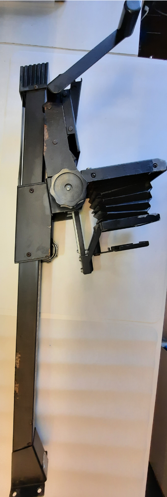

 
 
 

#  beseler_printmaker35
Restoration log of a used Beseler printmaker 35

----

A brand new unit

 

 

----

## Tasks

- [x] comment images
- [ ] Add base image

## Restroration of a used enlarger 

### Disassembly and cleaning

 

----

 

----

 

----
Head disassembled.  
- [ ] Check if the (missing?) concentrator Lens is needed, or difuse mode is ok 

 

----
some oxidation...

 

----
Head cover plate

 

----
The lens

 

----

 

----
The Lamp is PH140, with 120V working voltage. 
- [ ] Check for a 220V replacement
- [ ] Check for possible LED-lamp replacement

 

----
The main body, cleaned, has some minor oxidation

- [ ] Design/3D print a foldable mount to the base to save height when in storage

 

----
The head open and the US 120V plug for the lamp

 

----

## Links
### Beseler
* [beseler](https://www.beselerphoto.com/photography-enlargers/)
* [User Manual for Beseler Full Format 50mm Beslar Lens Kit for Printmaker 35 and 67 Series Enlargers](https://www.search-manual.com/beseler-full-format-50mm-beslar-lens-kit-for-printmaker-35-and-67-series-enlargers-7702-manual)
* [Printmaker-35-67-Exploded-View-_-Parts-List.pdf](https://www.beselerphoto.com/wp-content/uploads/2018/08/Printmaker-35-67-Exploded-View-_-Parts-List.pdf)
* [Looking for Parts for my Beseler Printmaker 35](https://www.photrio.com/forum/threads/looking-for-parts-for-my-beseler-printmaker-35.162185/)
* [Beseler Condenser Assembly for Printmaker 35](https://www.freestylephoto.biz/1045907-Beseler-Condenser-Assembly-for-Printmaker-35)
[manual](http://www.jollinger.com/photo/cam-coll/manuals/enlargers/beseler/Beseler_Printmaker_35_67_manual.pdf)

### Enlarger

* [Wikipedia: Enlarger](https://en.wikipedia.org/wiki/Enlarger)
 > ...A **condenser** enlarger consists of a light source, a condensing lens, a holder for the negative and a projecting lens. The condenser provides even illumination to the negative beneath it. Condenser enlargers produce higher contrast than diffusers because light is scattered from its path by the negative's image silver; this is called the Callier effect. The condenser's increased contrast emphasises any negative defects, such as dirt and scratches, and image grain.

> A **diffuser** enlarger's light source is diffused by translucent glass or plastic, providing even illumination for the film. Diffuser enlargers produce an image of the same contrast as a contact print from the negative

### DIY enlarger

* [How to Make a DIY Photo Enlarger from an Afghan Box Camera](https://petapixel.com/2021/09/28/how-to-make-a-diy-photo-enlarger-from-an-afghan-box-camera/)

* [Building an Enlarger.](https://www.photrio.com/forum/threads/building-an-enlarger.128663/)

>  A diffusion light source would be the easiest to build, 
and if you are working with 35mm especially, 
would likely give you the best quality prints.

* [Diffuser or Condenser](https://www.photrio.com/forum/threads/diffuser-or-condenser.87427/print)
> Most people, seem to prefer diffuser for 35mm

### 3D models
* https://www.yeggi.com/q/beseler+enlarger/