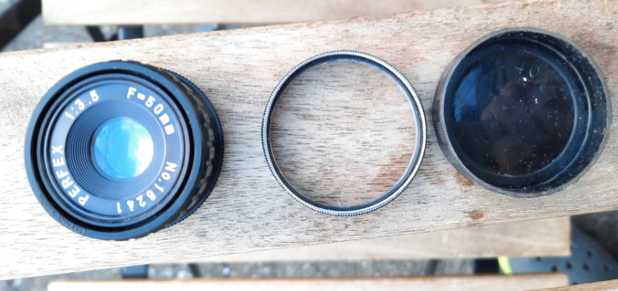

 
 
 

#  beseler_printmaker35

 

----

## Tasks

- [ ] comment images

----

 

----

 

----

 

----

 

----

 

----

 

----

 

----

 

----

 

----

## Links

* [beseler](https://www.beselerphoto.com/photography-enlargers/)
* [User Manual for Beseler Full Format 50mm Beslar Lens Kit for Printmaker 35 and 67 Series Enlargers](https://www.search-manual.com/beseler-full-format-50mm-beslar-lens-kit-for-printmaker-35-and-67-series-enlargers-7702-manual)
* [Printmaker-35-67-Exploded-View-_-Parts-List.pdf](https://www.beselerphoto.com/wp-content/uploads/2018/08/Printmaker-35-67-Exploded-View-_-Parts-List.pdf)
* [Looking for Parts for my Beseler Printmaker 35](https://www.photrio.com/forum/threads/looking-for-parts-for-my-beseler-printmaker-35.162185/)
* [Beseler Condenser Assembly for Printmaker 35](https://www.freestylephoto.biz/1045907-Beseler-Condenser-Assembly-for-Printmaker-35)
[manual](http://www.jollinger.com/photo/cam-coll/manuals/enlargers/beseler/Beseler_Printmaker_35_67_manual.pdf)

----

* [Wikipedia: Enlarger](https://en.wikipedia.org/wiki/Enlarger)

----
